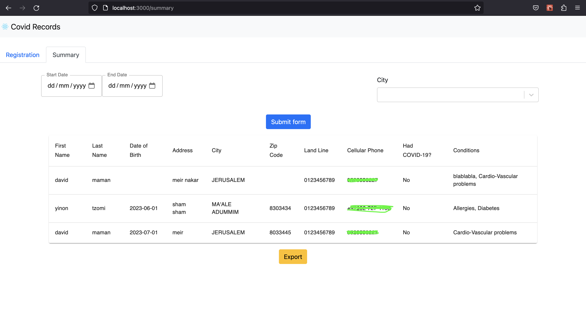

# Covid Records App
***
This project is designed to help underdeveloped countries track 
people who have contracted the corona virus.

## This project uses technologies:
1. Backend: Spring-boot and  PostgreSQL
2. Frontend: React js

## Prerequisites:
1. Docker
   Or
1. Java 17
2. npm
3. Node.js 17 
4. PostgreSQL

# Running the Project
You can run this project using either docker compose or localhost.

### Running by Docker:
1. Download docker app: ```https://www.docker.com```
2. At the root of the project, type in the terminal: ```docker compose up```

Now the project will run, you can access the url address in the browser:
```http://localhost:3000/```
The url where the server side works is:
```http://localhost:8080/user```

### Running localhost:
- Create a database called ```covidb```
- Change to your password in file ```backend/src/main/resources/application.yaml```
- At the root of the project, type in the terminal: ```cd backend```
  and then type ```mvn clean install``` to run backend app.
- Open new tab in the terminal, go to root project, type ```cd frontend```
  and then type ```npm install``` 
- When finish install all dependencies type ```npm run start``` and open 
  in your browser ```http://localhost:3000/```

### Backend endpoints with Postman
1. **POST** request to save user:
   - URL: ```http://localhost:8080/user```
   - and the body request (as json):

       ```json
       {
         "firstName": "David",
         "lastName": "Maman",
         "dateOfBirth": "1910-03-10",
         "city": "Jerusalem",
         "address": "Kiryat Yovel",
         "cellularPhone": "052-7777777",
         "landline": "02-555555",
         "infected": false,
         "zipCode": "945175",
         "previousConditions": [
           { "previousCondition": "a" },
           { "previousCondition": "b" },
           { "previousCondition": "c" }
         ]
       }
       ```

   You should receive a response with status 201 (Created) and the user details.
***
2. **GET** request to retrieve some data:
   - URL: ```http://localhost:8080/user```

    You should receive a response with status 200 (OK) and all the users.
***
3. **GET** request to retrieve specific user:
   -  URL: ```http://localhost:8080/user/byId/1```

    You should receive a response containing the user with id 1.
***
4. **GET** request to view all the users between dates:
   - URL: : ```http://localhost:8080/user/betweenDates```
   - Params:
       1. ```startDate = 1900-01-01``` 
       2. ```endDate = 2000-01-01```
   - The complete URL will be:
        > `http://localhost:8080/user/betweenDates?startDate=1900-01-01&endDate=2000-01-01`

    You should receive a response containing the all users between 1900-01-01 and 2000-01-01.
***
5. **GET** request to retrieve users by city:
   - ```http://localhost:8080/user/byCity/Jerusalem```

    You should receive a response the all users who live in Jerusalem.

# Screenshot frontend pages:

|  |  |
|:--------------------------------------------------------:|:----------------------------------------------:|


# Build and push

To build and push the service by terminal, follow these steps:
1) Go to backend path and run ```mvn clean install``` to build the backend project.
2) Use the command ```docker build -t  yourusername/covid:0.0.1 .```, replacing ```yourusername``` with your Docker Hub username.
3) Push the container to Docker Hub using ```docker push -t yourusername/covid:0.0.1```, this will make it available for Kubernetes to pull.
4) Go to frontend path, type ```npm install``` to install all dependencies and then ```npm run start```
5) Use the command ```docker build -t  yourusername/covid-front:0.0.1 .```, replacing ```yourusername```
      with your Docker Hub username.
6) Push the container to Docker Hub using ```docker push -t yourusername/covid-front:0.0.1```, this will make it available for Kubernetes to pull.
7) Finally, you can run the project using Docker Compose, as mentioned earlier.
